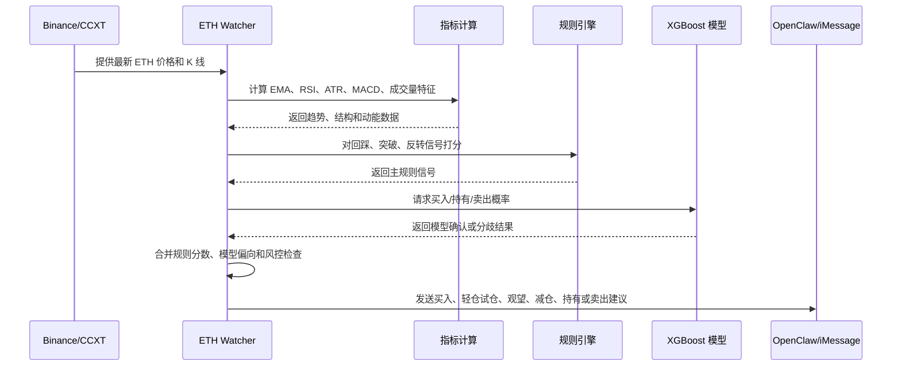

# ETH Watcher

`ETH Watcher` 现在已经从单一监控脚本升级成一个模块化的 ETH 分析框架。
它保留了原有的提醒和聊天链路，同时加入了历史数据下载、特征工程、
XGBoost 训练、ML 辅助实时评分、Backtrader 回测和图表输出能力。

[English](./README.md) | [简体中文](./README.zh-CN.md)

更新项目文档时，请同步维护 `README.md` 和 `README.zh-CN.md`。

## 信号流程图



## 功能概览

- 基于 `5m`、`15m`、`1h`、`4h` 的规则型 ETH 交易形态识别
- 用 `Pandas`、`NumPy` 计算技术指标和特征
- 用 `CCXT` 下载历史行情
- 构建可训练的监督学习特征集
- 用 `XGBoost` 训练信号模型并保存模型产物
- 用 `Backtrader` 跑回测
- 输出 SVG 和 Matplotlib 图表
- 继续支持 `OpenClaw` 的 iMessage 提醒、问答、每日日报和 cron 模式

## 安装

```bash
cd /path/to/eth-invest-agent
python3 -m pip install -r requirements.txt
```

为了适合公开仓库使用，建议把 `config.sample.json` 作为公开模板，把你真实的
个人配置放进 `config.local.json`（已被 git 忽略）。当 `config.local.json`
存在时，watcher 会自动优先使用它。

如果你希望真正接收提醒或聊天回复，建议先从样例配置复制：

```bash
cp config.sample.json config.local.json
```

然后再修改 `config.local.json`：

```json
{
  "display": {
    "price_currency": "CNY",
    "usd_cny_rate": 7.2,
    "use_live_fx": true,
    "live_fx_cache_minutes": 60
  },
  "notification": {
    "enabled": true,
    "target": "your-imessage-handle",
    "reply_language": "zh"
  }
}
```

仓库中的默认配置已经做过开源脱敏处理，所以默认关闭提醒，且目标为空。

`notification.reply_language` 支持：

- `zh`：发送中文消息
- `en`：发送英文消息

`display.price_currency` 当前支持：

- `CNY`：消息中的价格按人民币展示
- `USD`：消息中的价格按美元展示

当启用 `CNY` 后，提醒、问答、跟踪消息、每日日报和 `snapshot` 输出中的价格都会
统一按人民币展示。现在默认会优先拉取实时 USD/CNY 汇率并本地缓存；如果汇率接口
暂时不可用，才会回退到 `usd_cny_rate`。

## 快速开始

```bash
python3 ./scripts/eth_watcher.py snapshot
python3 ./scripts/eth_watcher.py run-once --send --dry-run
python3 ./scripts/eth_watcher.py chat-query --message "现在能买吗？"
python3 ./scripts/eth_watcher.py download-history --limit 300 --output data/binance_ethusdt_15m.csv
python3 ./scripts/eth_watcher.py build-features --input data/binance_ethusdt_15m.csv --output data/features_ethusdt_15m.csv
python3 ./scripts/eth_watcher.py train-model --features data/features_ethusdt_15m.csv
python3 ./scripts/eth_watcher.py backtest --input data/binance_ethusdt_15m.csv
python3 ./scripts/eth_watcher.py sweep-backtest --input data/binance_ethusdt_15m.csv
```

## 安全推送与当前运行目录

当前仓库目录已经是默认的真实运行目录。`OpenClaw cron`、聊天 hook、
`config.local.json` 和 `state/runtime.json` 都直接使用这个仓库，不再依赖
`~/.clawdbot/apps/eth-invest-agent` 下的单独运行副本。

如果你希望“当前运行代码”和“推送到 GitHub 的代码”长期保持一致，建议不要直接手动
执行 `git push`，而是使用内置的安全发布流程：

```bash
chmod +x ./scripts/push_and_sync.sh
./scripts/push_and_sync.sh
```

这套流程现在会按顺序执行两件事：

1. 只扫描 **Git 跟踪文件**，检查是否包含个人信息或敏感信息。
2. 将当前 `HEAD` 推送到 `origin`。

如果你只想单独执行一次“推送前隐私审计”：

```bash
python3 ./scripts/audit_tracked_files.py
```

由于当前仓库本身就是运行目录，所以推送成功后不需要再做额外同步。

## ML 工作流

### 1. 下载历史 K 线

```bash
python3 ./scripts/eth_watcher.py download-history \
  --exchange binance \
  --symbol ETH/USDT \
  --timeframe 15m \
  --limit 2000 \
  --output data/binance_ethusdt_15m.csv
```

### 2. 构建特征集

```bash
python3 ./scripts/eth_watcher.py build-features \
  --input data/binance_ethusdt_15m.csv \
  --output data/features_ethusdt_15m.csv \
  --horizon 4 \
  --threshold-pct 0.35
```

当前特征工程包括：

- 收益率和滚动波动率
- 成交量变化和 z-score
- `EMA20`、`EMA50`、`RSI14`、`ATR14`、`MACD histogram`
- breakout 和 pullback 相关衍生特征
- 面向 `buy / hold / sell` 映射的未来收益标签

### 3. 训练 XGBoost 模型

```bash
python3 ./scripts/eth_watcher.py train-model \
  --features data/features_ethusdt_15m.csv \
  --model-output models/xgboost_eth_signal.json \
  --metadata-output models/xgboost_eth_signal.meta.json
```

训练完成后会写出：

- `models/` 下的模型权重
- `models/` 下的特征元数据
- 终端里的最新样本预测结果

### 4. 运行回测

```bash
python3 ./scripts/eth_watcher.py backtest \
  --input data/binance_ethusdt_15m.csv \
  --model-path models/xgboost_eth_signal.json \
  --metadata-path models/xgboost_eth_signal.meta.json \
  --entry-prob-threshold 0.34 \
  --exit-prob-threshold 0.42 \
  --min-hold-bars 2
```

现在这个命令默认还会在 `reports/backtest/` 下生成一个带时间戳的报告目录，
其中包括：

- `summary.json`
- `trades.csv`
- `equity_curve.csv`
- `price_signals.png`
- `equity_curve.png`
- `monthly_returns.png`

同时还会维护 `reports/latest/backtest` 软链接，始终指向最近一次回测报告，
方便你每天直接打开最新结果。

当前回测层使用 `Backtrader`，并实现了一个简化的风险控制框架：

- 按风险比例决定仓位大小
- ATR 止损
- reward/risk 止盈
- 触发止损、止盈、看空信号翻转或看空概率翻转时退出
- 支持用概率阈值调节交易频率的松紧度

当前回测输出已经包括：

- 总收益率
- 胜率
- 最大回撤
- 年化波动率
- 年化 Sharpe
- 按月收益
- 退出原因分布
- 最优和最差交易
- 完整交易明细

### 4a. 参数扫描

```bash
python3 ./scripts/eth_watcher.py sweep-backtest \
  --input data/binance_ethusdt_15m.csv \
  --entry-prob-thresholds 0.28,0.30,0.34 \
  --exit-prob-thresholds 0.34,0.36,0.42 \
  --stop-loss-atrs 1.0,1.3,1.6 \
  --top 10
```

它会在 `reports/sweeps/` 下生成一个带时间戳的目录，里面包含：

- `summary.json`
- `grid.csv`
- 每个 `stop_loss_atr` 对应一张收益热力图

同时还会维护 `reports/latest/sweeps` 软链接，始终指向最近一次参数扫描结果。

现在 `sweep-backtest` 默认还会自动挑选收益排名最高的一组参数，并回写到
`config.json` 里的：

- `ml.backtest_defaults`
- `ml.recommended_backtest`

这样你后续直接运行 `backtest` 时，即使不再手动传阈值，也会优先复用最新推荐
默认参数。如果你只想看扫描结果、不改配置，可加 `--no-apply-best-to-config`。

### 5. 把模型接入实时 watcher

当默认模型文件已经存在于 `models/` 后，`snapshot`、`run-once` 和可选的
`daemon` 模式会自动尝试把模型结果融合进实时分析流程。

当前融合方式：

- 规则信号仍然是主引擎
- 模型输出作为辅助分和概率提示
- 强看多模型确认可以把 `near_buy` 升级
- 明显看空分歧可以把过激信号降级
- 提醒、问答和每日日报现在都会给出更直接的操作倾向：买入、轻仓试仓、观望、
  减仓、持有或卖出
- 面向用户的价格显示现在支持在 `人民币` 和 `美元` 之间切换
- 消息语言现在支持在 `中文` 和 `英文` 之间切换

## 提醒与问答

### 本地命令行交互

```bash
python3 ./scripts/eth_watcher.py snapshot
python3 ./scripts/eth_watcher.py chat-query --message "距离买点多远？"
python3 ./scripts/eth_watcher.py position-status
```

### 默认 cron 模式

这已经是推荐的生产运行方式。watcher 通过 `OpenClaw cron` 定时调度，并直接
运行当前仓库：

```bash
openclaw cron list
openclaw cron runs --id 52bfec18-3cac-42b4-95a3-77547800b40b --limit 5
```

当前默认行为：

- 当前仓库目录就是唯一运行代码源
- `config.local.json` 是私有运行配置
- `state/runtime.json` 保存运行状态和每日日报审计
- `eth-watcher-minute` 通过 OpenClaw 每分钟执行一次 `run-once --send`

### 可选 daemon 模式

```bash
python3 ./scripts/eth_watcher.py daemon
```

当前 watcher 仍然可以发送：

- 交易提醒
- 提醒后的跟踪消息
- 每日固定时段市场摘要

### iMessage 主动提问

先启用 hook：

```bash
openclaw hooks enable eth-chat
openclaw gateway restart
```

然后可以问：

- `ETH`
- `现在能买吗？`
- `现在要不要卖？`
- `距离买点多远？`
- `可以先小仓试一下吗？`
- `当前表现如何？`
- `持仓状态`
- `为什么这么判断？`
- `HELP`

英文提问同样支持。

### 如何确认 hook 生效

```bash
openclaw hooks list --verbose
rg "Registered hook: eth-chat|eth-chat" ~/.openclaw/logs/gateway.log
```

## 每日日报与 Cron

每日日报配置示例：

```json
{
  "display": {
    "price_currency": "CNY",
    "usd_cny_rate": 7.2,
    "use_live_fx": true,
    "live_fx_cache_minutes": 60
  },
  "notification": {
    "reply_language": "zh",
    "daily_summary": {
      "enabled": true,
      "send_times": ["09:00"],
      "attach_chart": true,
      "llm_enabled": true,
      "llm_timeout_seconds": 120,
      "openclaw_agent_id": "eth-daily-summary",
      "thinking": "off"
    }
  }
}
```

当 `notification.enabled=true`、`target` 已配置为你的 iMessage 目标，且
OpenClaw 的 hook / 默认 cron 已启用后，每日日报链路就是：

1. `run-once --send` 拉取最新 ETH 数据，通常由默认的 OpenClaw cron 定时触发。
2. watcher 生成规则 + ML 融合分析，并附带买卖建议。
3. `send_daily_summary()` 通过 OpenClaw 发送日报。
4. OpenClaw 把消息投递到你配置的 iMessage 目标。

因此日常使用上，你现在可以直接获得：

- 实时 ETH 价格变化监测
- 买入 / 轻仓试仓 / 观望 / 减仓 / 卖出建议
- 通过 iMessage 定时收到市场分析日报和未来 24 小时展望

如果想降低 token 成本，建议：

- 单独为日报使用 `eth-daily-summary`
- 保持该 agent 的 workspace 尽量小
- 尽量使用本地模型

最近的每日日报发送审计保存在 `state/runtime.json`：

- `daily_summary.last_audit`
- `daily_summary.audit_history`

`OpenClaw cron` 现在就是默认推荐的调度方式。`daemon` 更适合作为本地实验或临时调试时的备用模式。

## 重要配置项

- `symbol`：默认 `ETHUSDT`
- `strategy_profile`：`scalp`、`balanced`、`swing`
- `display.price_currency`：面向用户显示价格时使用 `CNY` 或 `USD`
- `display.usd_cny_rate`：实时汇率不可用时使用的美元兑人民币兜底汇率
- `display.use_live_fx`：人民币显示时是否优先拉取实时 USD/CNY 汇率
- `display.live_fx_cache_minutes`：实时汇率在本地缓存的分钟数
- `notification.*`：提醒、跟踪、问答、每日日报相关行为
- `notification.reply_language`：所有外发消息使用 `zh` 或 `en`
- `ml.enabled`：是否启用模型辅助实时评分
- `ml.model_path`：默认模型路径
- `ml.metadata_path`：特征元数据路径
- `ml.feature_limit`：实时构建特征时读取的最近 bar 数
- `ml.target_horizon`：标签预测周期
- `ml.target_threshold_pct`：标签阈值百分比

## 仓库结构

- `scripts/eth_watcher.py`：统一编排入口和 CLI
- `eth_agent/config.py`：配置默认值和加载逻辑
- `eth_agent/state.py`：运行时状态默认值和归一化
- `eth_agent/data/`：Binance 获取逻辑和 `CCXT` 下载器
- `eth_agent/features/`：指标和特征工程
- `eth_agent/models/`：XGBoost 训练和推理
- `eth_agent/strategy/`：规则信号引擎
- `eth_agent/risk/`：跟踪和风险控制辅助逻辑
- `eth_agent/backtest/`：Backtrader 集成
- `eth_agent/visualization/`：SVG 和 Matplotlib 图表
- `hooks/eth-chat/`：OpenClaw 聊天 hook
- `scripts/push_and_sync.sh`：Git 跟踪文件隐私审计 + `git push`
- `config.sample.json`：适合公开仓库的示例配置
- `config.local.json`：私有本地覆写配置（已忽略）
- `config.json`：回退用本地配置
- `state/runtime.json`：运行时状态
- `deploy_runtime_copy.sh`：历史兼容脚本，现已不再用于实际运行

## 注意事项

- 实时 watcher 目前仍以规则引擎为主，ML 层只是辅助确认。
- 这个仓库适合做分析、实验和策略验证，不是自动盈利保证。
- 所有内容仅供参考，不构成投资建议。
